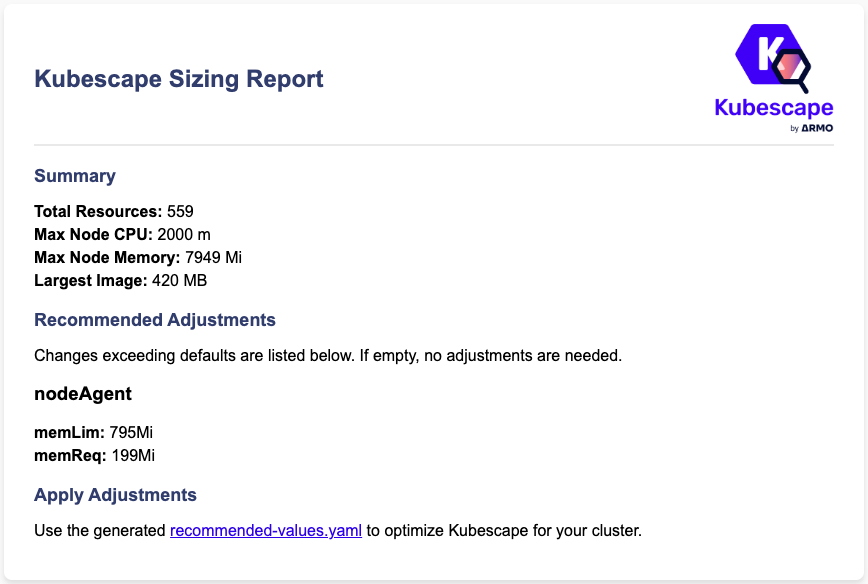

# Kubescape Sizing Checker

## Overview

Kubescape Sizing Checker analyzes your Kubernetes cluster's resources and generates recommended Helm values to ensure Kubescape runs smoothly and efficiently.

## Prerequisites

- **Kubeconfig** configured for access to the Kubernetes cluster where you plan to deploy Armo.

## Run the Check

There are two ways to run the check:

### Option 1 - Local Run

1. Navigate to the command directory and Execute the program:
   ```sh
   cd /cmd
   go run .
   ```

### Option 2 - In-cluster Run

#### Prerequisites

- **Permissions** to create ServiceAccounts, ClusterRoles, ClusterRoleBindings, and Jobs.

1. **Deploy the Kubernetes manifest:**

   Apply the Kubernetes manifest to set up the necessary resources:

   ```sh
   kubectl apply -f k8s-manifest.yaml
   ```

2. **Verify Job Completion:**

   Check the status and logs of the Job:

   ```sh
   kubectl wait --for=condition=complete job/kubescape-prerequisite --timeout=60s
   kubectl logs job/kubescape-prerequisite
   ```

3. **Export the Files:**

   Retrieve the `recommended-values.yaml` and `sizing-report.html` from the ConfigMap:

   ```sh
   kubectl get configmap kubescape-sizing-report -n default -o go-template='{{ index .data "recommended-values.yaml" }}' > recommended-values.yaml
   kubectl get configmap kubescape-sizing-report -n default -o go-template='{{ index .data "sizing-report.html" }}' > sizing-report.html
   ```

## Usage

### Deploy Kubescape with Recommended Resources

Use Helm to deploy Kubescape using the recommended values:

```sh
helm upgrade --install kubescape kubescape/kubescape-operator \
  --namespace kubescape --create-namespace \
  --values recommended-values.yaml [other parameters]
```

### View the Sizing Report

If you want to review the sizing report, open the HTML file:

**Open in Browser:**

- **macOS:**
    ```sh
    open sizing-report.html
    ```
- **Linux:**
    ```sh
    xdg-open sizing-report.html
    ```
- **Windows (Git Bash):**
    ```sh
    start sizing-report.html
    ```

## Output
### Local Run
    ```------------------------------------------------------------
    ✅ Sizing report generated locally!
    • /tmp/sizing-report.html (HTML report)
    • /tmp/recommended-values.yaml (Helm values file)

    📋 Open /tmp/sizing-report.html in your browser for details.
    🚀 Use the generated recommended-values.yaml to optimize Kubescape for your cluster.
    ------------------------------------------------------------
    ```


### In-cluster Run
    ```sh
    kubectl logs job/kubescape-prerequisite
    ```
    ```------------------------------------------------------------
    ✅ Sizing report stored in Kubernetes ConfigMap!
    • ConfigMap Name: sizing-report
    • Namespace: default
    ------------------------------------------------------------

    ⬇️ To export the report and recommended values to local files, run the following commands:
        kubectl get configmap kubescape-sizing-report -n default -o go-template='{{ index .data "sizing-report.html" }}' > sizing-report.html
        kubectl get configmap kubescape-sizing-report -n default -o go-template='{{ index .data "recommended-values.yaml" }}' > recommended-values.yaml

    📋 Open sizing-report.html in your browser for details.
    🚀 Use the generated recommended-values.yaml to optimize Kubescape for your cluster.
    ------------------------------------------------------------
    ```

### Report example
